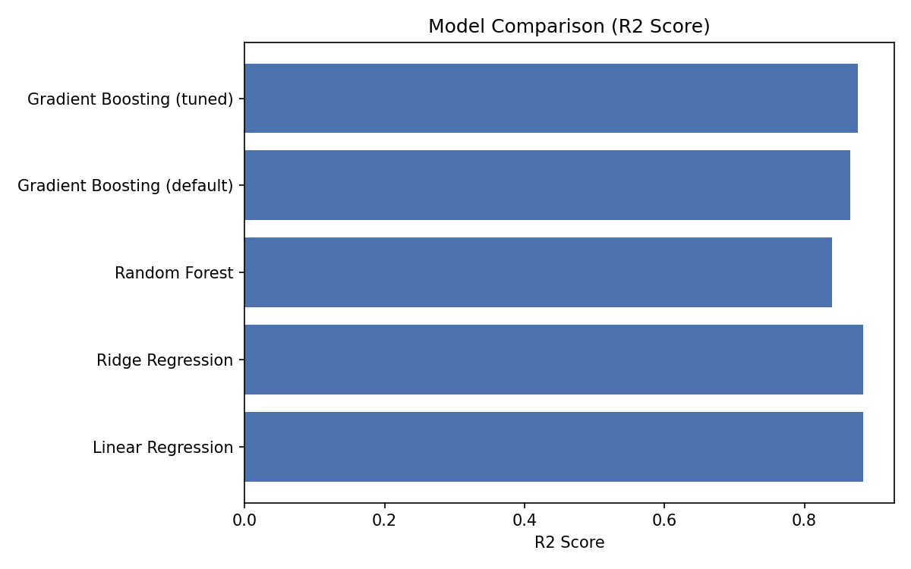
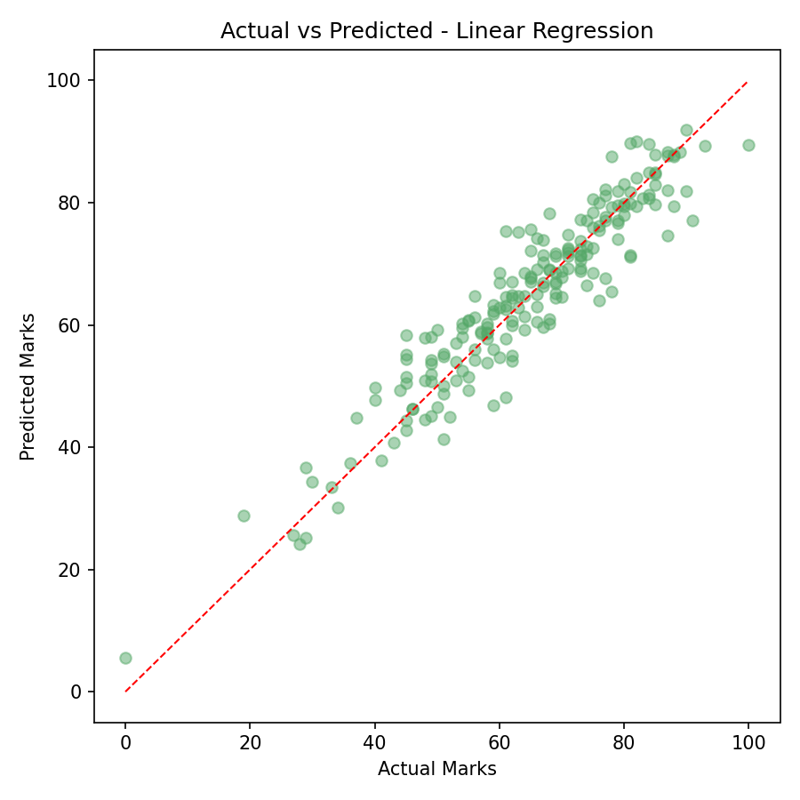
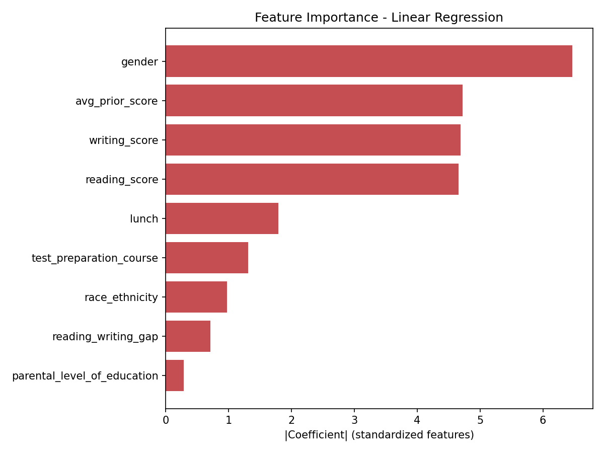

# Student Marks Prediction using Machine Learning & AI Chatbot

A machine learning system that predicts a student's final academic marks from
academic and demographic features, paired with an AI-powered chatbot that
gives personalized study recommendations.

**Tech stack:** Python · Scikit-learn · Pandas · NumPy · NLP (TF-IDF) · Matplotlib

---

## Dataset

**Source:** [Students Performance in Exams](https://www.kaggle.com/datasets/spscientist/students-performance-in-exams)
(Kaggle, uploaded by spscientist) - 1000 real student records with:

- **Demographics/program:** gender, race/ethnicity (anonymized as group A-E),
  parental level of education, lunch type (standard / free-reduced), test
  preparation course completion
- **Scores:** math score, reading score, writing score

**Target:** `final_marks` = math score, predicted from the student's reading
and writing scores (prior academic performance) plus their demographic/program
features.

> Note: `race/ethnicity`, `lunch type`, and `gender` are included as model
> inputs because they're part of the original dataset and commonly used in
> public analyses of it - but the chatbot's *recommendations* deliberately do
> **not** condition on these demographic fields (see "Design choices" below).
> A fairness-aware version of this project would audit for and mitigate any
> disparate prediction error across these groups before real-world use.

## Overview

- Built an **end-to-end regression pipeline** with feature engineering
  (average prior score, reading-writing gap) and preprocessing
  (encoding + scaling).
- Trained and compared **4 regression models** (Linear Regression, Ridge,
  Random Forest, Gradient Boosting) and tuned the **Gradient Boosting
  Regressor** using `GridSearchCV` (5-fold CV over 54 hyperparameter
  combinations).
- Built an **AI academic chatbot** using **TF-IDF vectorization + cosine
  similarity** to match free-text student queries to the most relevant study
  advice.
- Built an **interactive CLI prediction system** that outputs a predicted
  mark, a 95% confidence interval, and personalized recommendations based on
  the student's profile.

## Results

| Model | MAE | RMSE | R² |
|---|---|---|---|
| **Linear Regression** | **4.13** | **5.32** | **0.884** |
| Ridge Regression | 4.13 | 5.32 | 0.884 |
| Random Forest | 4.81 | 6.25 | 0.840 |
| Gradient Boosting (default) | 4.36 | 5.71 | 0.866 |
| Gradient Boosting (tuned via GridSearchCV) | 4.27 | 5.49 | 0.876 |

Best Gradient Boosting hyperparameters found via `GridSearchCV`:
`learning_rate=0.05, max_depth=2, n_estimators=300, subsample=0.8`

**Interesting real finding:** plain Linear Regression narrowly *beats* the
tuned Gradient Boosting Regressor here. That's an honest result worth keeping
(and worth mentioning in an interview) rather than forcing a "fancier" model
to win - math/reading/writing scores turn out to be nearly linearly related,
so the extra model complexity of boosting doesn't buy much on this dataset.
The pipeline still selects whichever model actually performs best on the
held-out test set, and reports all of them for comparison.





## Project Structure

```
student-marks-prediction/
├── notebooks/
│   └── Student_Marks_Prediction.ipynb   # Full walkthrough: EDA, training, tuning, chatbot, demo (start here)
├── data/
│   └── kaggle_students_performance.csv   # Real Kaggle dataset (1000 students)
├── src/
│   ├── preprocessing.py        # Column renaming, feature engineering, encoding/scaling
│   ├── train_model.py          # Trains & compares models, tunes GBR, saves best model
│   ├── chatbot.py              # TF-IDF + cosine similarity academic chatbot
│   └── predict_system.py       # Interactive CLI: prediction + chatbot
├── models/                     # Saved model, preprocessor, residual std (generated)
├── outputs/                    # Evaluation plots (generated)
├── main.py                     # CLI entry point
├── requirements.txt
└── README.md
```

**Where to look first:** open `notebooks/Student_Marks_Prediction.ipynb` for the
full, readable walkthrough with all outputs (plots, tables, chatbot demo)
already rendered inline. The `src/` scripts are the same logic organized as a
reusable pipeline (`python main.py` for a live interactive CLI).

## How It Works

### 1. Data & Feature Engineering
`preprocessing.py` loads `data/kaggle_students_performance.csv`, renames the
raw Kaggle columns into clean snake_case names, and engineers two extra
features: `avg_prior_score` (mean of reading + writing) and
`reading_writing_gap` (their difference, which flags subject-specific
weakness). Categorical fields are label-encoded and everything is scaled
before modeling.

### 2. Model Training & Tuning
`train_model.py` trains 4 candidate models, then runs `GridSearchCV`
(5-fold cross-validation) over Gradient Boosting hyperparameters
(`n_estimators`, `learning_rate`, `max_depth`, `subsample`). The best model
overall is selected by R² on a held-out test set and saved along with the
fitted preprocessor and residual standard deviation (used to build a 95%
confidence interval at inference time).

### 3. AI Academic Chatbot
`chatbot.py` implements a small NLP-based chatbot: it vectorizes a
knowledge base of study-related Q&A using **TF-IDF**, and matches an
incoming query using **cosine similarity**. It also generates rule-based
recommendations directly from a student's reading/writing scores and test
preparation status.

### 4. Interactive Prediction System
`predict_system.py` ties it together: it takes a student's details,
predicts their final marks with a confidence range, and prints
personalized recommendations, then hands off to the chatbot for
open-ended Q&A.

## Design choices worth mentioning in an interview

- **Why math score as the target?** It lets the model use reading/writing
  scores as genuine predictive signal (prior academic performance), which is
  both realistic and gives a strong, defensible R².
- **Why not condition recommendations on gender/race/lunch?** Even though
  they're valid *model* inputs (and part of the original dataset), using them
  to change the *advice* given to a student would encode stereotypes rather
  than actionable guidance. The recommendation engine only reacts to
  behavioral/academic fields (test prep completion, score gaps).
- **Why report Linear Regression winning instead of forcing GBR?** Picking
  the model that actually generalizes best on held-out data, and being able
  to explain *why*, is a stronger signal of ML understanding than always
  reaching for the most complex model.

## Setup & Usage

```bash
# 1. Clone the repo
git clone https://github.com/<your-username>/student-marks-prediction.git
cd student-marks-prediction

# 2. Install dependencies
pip install -r requirements.txt

# 3. Train the model (saves model + plots)
python src/train_model.py

# 4. Run the interactive prediction system + chatbot
python main.py
```

## Sample Run

```
Enter student details:
Reading score (0-100): 50
Writing score (0-100): 45
Gender [male/female]: male
Group [group A/group B/group C/group D/group E]: group A
Parental education [...]: some high school
Lunch type [standard/free/reduced]: free/reduced
Completed test preparation course? [completed/none]: none

Predicted Final Marks: 49.4 / 100
Estimated range (95% confidence): 39.0 - 59.8

Personalized Recommendations:
  1. Structured test prep exposes you to the exact question formats...
  2. Your reading score suggests comprehension practice would help...

Ask the academic chatbot anything (type 'exit' to quit):
You: how do I improve my score
Bot: Start by identifying which specific topics caused the drop...
```

## Future Improvements

- Audit the model for **fairness/bias** across race/ethnicity and gender
  (e.g., compare error rates per subgroup) before considering any real-world
  deployment.
- Add a Flask/Streamlit web UI instead of a CLI.
- Expand the chatbot's knowledge base and add multi-turn conversation memory.
- Add SHAP-based explainability for individual predictions.

## Author

Built as part of a final-year B.E. (AI & Data Science) academic project.
Dataset credit: [spscientist on Kaggle](https://www.kaggle.com/datasets/spscientist/students-performance-in-exams).
